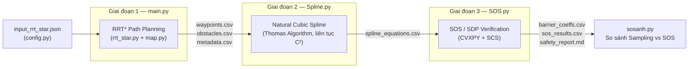

<div align="center">

# Xác minh An toàn Hình thức cho Quỹ đạo Robot Tự hành
### RRT\* → Natural Cubic Spline → SOS/SDP Certificate

**Đồ án tốt nghiệp — Toán ứng dụng, Trường Đại học Giao thông Vận tải (K63)**

[](https://www.python.org/)
[](LICENSE)
[](https://www.cvxpy.org/)

</div>

---

## Giới thiệu

Bài toán đặt ra: một robot di động trong nhà kho cần di chuyển từ điểm `Start` đến điểm `Goal`, tránh va chạm với các vật cản tĩnh (tường, kệ hàng, bãi hàng) và vật cản động được sinh ngẫu nhiên (kiện hàng vuông, vật tròn).

Thay vì chỉ kiểm tra va chạm bằng **lấy mẫu rời rạc** (sampling) — phương pháp phổ biến nhưng về lý thuyết có thể bỏ sót va chạm xảy ra *giữa* hai điểm mẫu — đồ án xây dựng một pipeline 3 giai đoạn để **chứng minh an toàn bằng giải tích (formal verification)** cho toàn bộ quỹ đạo liên tục, dựa trên lý thuyết **Sum-of-Squares (SOS)** và **Semidefinite Programming (SDP)**.

> Quỹ đạo được chứng minh an toàn không phải vì "đã kiểm tra đủ nhiều điểm", mà vì tồn tại một **chứng chỉ toán học (certificate)** đảm bảo điều đó đúng tại **mọi** thời điểm liên tục trên đoạn đường.

---

## Mục lục

- [Kiến trúc Pipeline](#kiến-trúc-pipeline)
- [Cơ sở lý thuyết](#cơ-sở-lý-thuyết)
- [Cấu trúc thư mục](#cấu-trúc-thư-mục)
- [Cài đặt](#cài-đặt)
- [Hướng dẫn sử dụng](#hướng-dẫn-sử-dụng)
- [Tham số đầu vào](#tham-số-đầu-vào-input_rrt_starjson)
- [Kết quả minh họa](#kết-quả-minh-họa)
- [Tài liệu tham khảo](#tài-liệu-tham-khảo)
- [Giấy phép](#giấy-phép)
- [Tác giả](#tác-giả)

---

## Kiến trúc Pipeline

Ba giai đoạn chạy **tuần tự**, giao tiếp với nhau qua file CSV trong thư mục `outputs/run_<timestamp>/` (không qua bước rút gọn waypoint trung gian như RDP):



| Giai đoạn | File | Đầu vào | Đầu ra | Vai trò |
|---|---|---|---|---|
| 1 | `main.py` (`rrt_star.py`, `map.py`) | `input_rrt_star.json` | `waypoints.csv`, `obstacles.csv`, `metadata.csv`, ảnh bản đồ | Sinh đường đi thô, tiệm cận tối ưu (asymptotically optimal) bằng RRT\* |
| 2 | `Spline.py` | `waypoints.csv` | `spline_equations.csv`, ảnh spline | Làm trơn waypoint rời rạc thành quỹ đạo liên tục C² bằng Natural Cubic Spline |
| 3 | `SOS.py` | `spline_equations.csv`, `obstacles.csv` | `barrier_coeffs.csv`, `sos_results.csv`, `safety_report.md`, ảnh xác minh | Chứng minh an toàn hình thức từng đoạn spline với từng vật cản bằng SOS/SDP |
| (Phụ trợ) | `sosanh.py` | `barrier_coeffs.csv` | `sampling_comparison_4_3_5.csv` | So sánh khả năng phát hiện vi phạm: sampling rời rạc (N điểm) vs SOS liên tục |

---

## Cơ sở lý thuyết

### 1. RRT\* — Sinh đường đi tối ưu tiệm cận

Robot được mô hình hóa dưới dạng đĩa bán kính `r_plan = robot_radius + safety_margin`. Va chạm được kiểm tra bằng **Minkowski sum chính xác** (khoảng cách điểm–hình chữ nhật / điểm–tâm hình tròn), không dùng AABB xấp xỉ thô tại các góc.

Bán kính lân cận `r_n` trong bước *rewire* được chọn theo điều kiện đủ của Karaman & Frazzoli (Theorem 38) để đảm bảo RRT\* hội tụ tiệm cận tối ưu:

```
r_n = min( γ · (log n / n)^(1/2),  r_max ),   với  γ > √3 · √(μ_free / π)
```

### 2. Natural Cubic Spline — Làm trơn C²

Tập waypoint rời rạc từ RRT\* được nội suy bằng **Natural Cubic Spline** (tham số hóa theo arc-length, giải hệ phương trình moment bằng **thuật toán Thomas** cho ma trận ba đường chéo). Kết quả là quỹ đạo `x(s), y(s)` liên tục C² (vị trí, vận tốc, gia tốc đều liên tục tại mọi nút), được xác minh số học residual tại từng điểm nối (junction).

### 3. SOS/SDP — Chứng chỉ an toàn hình thức

Với mỗi cặp (đoạn spline, vật cản), hàm rào chắn (barrier function) `B(τ)` bậc 6 được định nghĩa sao cho `B(τ) ≥ 0` trên `τ ∈ [0, h]` **tương đương** với việc đoạn quỹ đạo đó không va chạm với vật cản.

Theo **định lý Lukács (1918)**, một đa thức một biến không âm trên một đoạn hữu hạn luôn phân tích được thành tổng của (tối đa) hai dạng bình phương (SOS). Việc tồn tại phân tích này được kiểm tra bằng cách giải một bài toán **Semidefinite Programming (SDP)** với `CVXPY` + solver `SCS`:

- **Feasible (tồn tại Q₀, Q₁ ⪰ 0)** → `B(τ) ≥ 0 ∀τ ∈ [0,h]` → **chứng minh được an toàn (SAFE)**, không phải "không tìm thấy vi phạm trong N mẫu".
- **Infeasible** → không chứng minh được an toàn bằng SOS bậc này → đoạn được đánh dấu **UNSAFE** để xem xét lại (cảnh báo thận trọng, không khẳng định chắc chắn va chạm).

Sai số chứng chỉ (Gram matrix → đa thức SOS) được đánh giá **chính xác bằng giải tích** (tìm nghiệm đạo hàm, không lấy mẫu lưới) để tránh sai số do rời rạc hóa làm sai lệch kết luận.

Vật cản hình chữ nhật (tường, kệ, bãi hàng) được xử lý bằng **Adaptive Circle Decomposition**, đảm bảo điều kiện *coverage invariant* đúng cho mọi tỉ lệ cạnh, bao gồm cả tường mỏng — thay cho cách kiểm tra rời rạc theo 4 góc (logic cũ, đã loại bỏ vì có thể bỏ sót va chạm xuyên tâm tường).

---

## Cấu trúc thư mục

```
.
├── input_rrt_star.json   # Nguồn tham số DUY NHẤT (start/goal, robot, RRT*, map)
├── config.py              # Đọc JSON 1 lần, export hằng số cho toàn hệ thống
├── map.py                 # Sinh bản đồ nhà kho (vật cản tĩnh + ngẫu nhiên), vẽ minh họa
├── rrt_star.py             # Thuật toán RRT* (Node, collision check, choose-parent, rewire)
├── main.py                 # Điều phối Giai đoạn 1: chạy RRT*, lưu CSV + ảnh
├── Spline.py                # Giai đoạn 2: Natural Cubic Spline (thuật toán Thomas)
├── SOS.py                   # Giai đoạn 3: chứng minh an toàn bằng SOS/SDP (CVXPY)
├── sosanh.py                # Phụ trợ: so sánh sampling rời rạc vs SOS liên tục
├── outputs/                  # Kết quả mỗi lần chạy (run_<timestamp>/), không commit
├── docs/images/               # Ảnh minh họa cho README (thêm thủ công)
├── requirements.txt
├── LICENSE
└── README.md
```

---

## Cài đặt

Yêu cầu **Python ≥ 3.10** (do `config.py` dùng cú pháp union type `int | None`).

```bash
git clone https://github.com/<your-username>/<your-repo>.git
cd <your-repo>

python -m venv venv
source venv/bin/activate        # Windows: venv\Scripts\activate

pip install -r requirements.txt
```

---

## Hướng dẫn sử dụng

Chạy đúng thứ tự 3 (hoặc 4) lệnh sau, mỗi script tự tìm thư mục `outputs/run_*` mới nhất do bước trước tạo ra:

```bash
# 1. Sinh bản đồ + chạy RRT* path planning
python main.py

# 2. Làm trơn waypoint bằng Natural Cubic Spline
python Spline.py

# 3. Chứng minh an toàn từng đoạn bằng SOS/SDP
python SOS.py

# 4. (Tùy chọn) So sánh khả năng phát hiện vi phạm: sampling vs SOS
python sosanh.py
```

Mỗi lần chạy `main.py` sẽ tạo một thư mục mới `outputs/run_YYYYMMDD_HHMMSS/`, chứa toàn bộ CSV trung gian và ảnh kết quả — giúp tái lập (reproducibility) từng lần thử nghiệm, kể cả khi bản đồ được sinh ngẫu nhiên (seed dùng thực tế luôn được lưu lại trong `metadata.csv`).

---

## Tham số đầu vào (`input_rrt_star.json`)

| Nhóm | Tham số | Ý nghĩa |
|---|---|---|
| `robot` | `start`, `goal` | Tọa độ điểm xuất phát / đích (m) |
| | `radius`, `safety_margin` | Bán kính robot + biên an toàn → `r_plan = radius + safety_margin` |
| `rrt_param` | `max_iter` | Số vòng lặp tối đa của RRT\* |
| | `step_size` | Độ dài bước *steer* mỗi lần mở rộng cây |
| | `goal_sample_rate` | Tỉ lệ lấy mẫu trực tiếp về phía `goal` |
| | `goal_tolerance` | Bán kính vùng được coi là "đã tới đích" |
| | `gamma_scale`, `r_max` | Tham số bán kính lân cận trong *rewire* (Karaman & Frazzoli) |
| `map` | `n_squares`, `n_circles` | Số vật cản ngẫu nhiên (kiện hàng vuông / vật tròn) |
| | `seed` | `null` → sinh seed ngẫu nhiên mỗi lần chạy; hoặc số nguyên cố định để tái lập |

Chỉ cần sửa file JSON này — không cần sửa code — để thử nghiệm với cấu hình khác.

---

## Kết quả minh họa

> Thêm ảnh thực tế từ `outputs/run_.../` vào `docs/images/` rồi chèn vào đây, ví dụ:
> ``

Một lần chạy thử nghiệm trên bản đồ **40×30 m với 74 vật cản** (34 vật cản cố định: tường/kệ/bãi hàng + 40 vật cản ngẫu nhiên: 20 vuông, 20 tròn) cho kết quả minh họa:

| Bước lọc | Số cặp (đoạn spline × vật cản) |
|---|---|
| Tổng số cặp ban đầu | 1.998 |
| Sau lọc AABB sơ bộ (`prefilter`) | 17 |
| → Chứng minh **SAFE** bằng SOS | 14 |
| → **Không chứng minh được** (cần xem lại) | 3 |

Việc lọc AABB giúp loại bỏ nhanh các cặp rõ ràng không thể va chạm (cách xa nhau), trước khi đưa 17 cặp "khả nghi" còn lại vào bài toán SDP — giảm đáng kể thời gian tính toán so với giải SOS cho toàn bộ 1.998 cặp.

---

## Tài liệu tham khảo

- Karaman, S. & Frazzoli, E. (2011). *Sampling-based algorithms for optimal motion planning*. The International Journal of Robotics Research, 30(7), 846–894.
- Lukács, F. (1918). *Verschärfung des ersten Mittelwertsatzes der Integralrechnung für rationale Polynome*. Mathematische Zeitschrift.
- Parrilo, P. A. (2000). *Structured Semidefinite Programs and Semialgebraic Geometry Methods in Robustness and Optimization*. PhD Thesis, Caltech.
- Prajna, S. & Jadbabaie, A. (2004). *Safety Verification of Hybrid Systems Using Barrier Certificates*. Hybrid Systems: Computation and Control (HSCC).

---

## Giấy phép

Phát hành theo **MIT License** — xem chi tiết tại [LICENSE](LICENSE).

## Tác giả

**Đinh Hoàng Quân**
Sinh viên năm cuối ngành Toán ứng dụng (K63) — Trường Đại học Giao thông Vận tải
Đồ án tốt nghiệp, 2026
